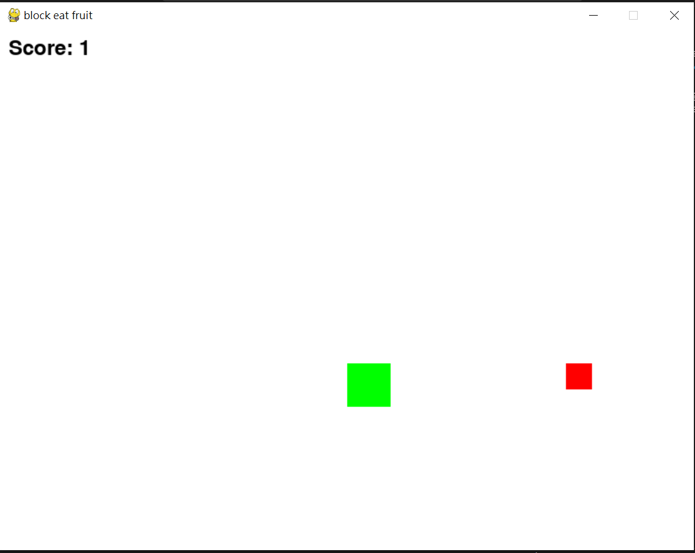

# Pygame
## this is the practice of Pygame
1. block_eat_fruit
2. to be continued...

## Block eat fruit

### How to play?

There are a green block, player, a red block, fruit, and the score in the window.

The player can control block to eat fruit using up, down, right, and left on the keyboard.

This is a small game to be familiar wiht the Pygame language.
